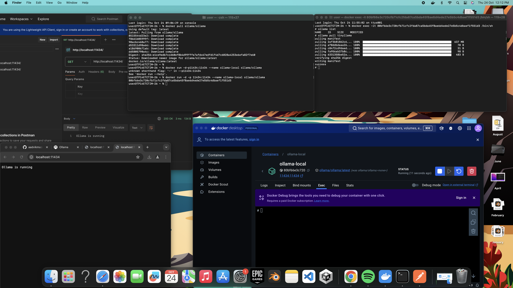

# LLM-s-using-socket-programming
SRM International week workshop on development of LLM's using socket programming in Python by Mohak Narag

Few snapshots of my work

  

https://github.com/ollama/ollama/blob/main/docs/modelfile.md -- ollama tutorial sheet
